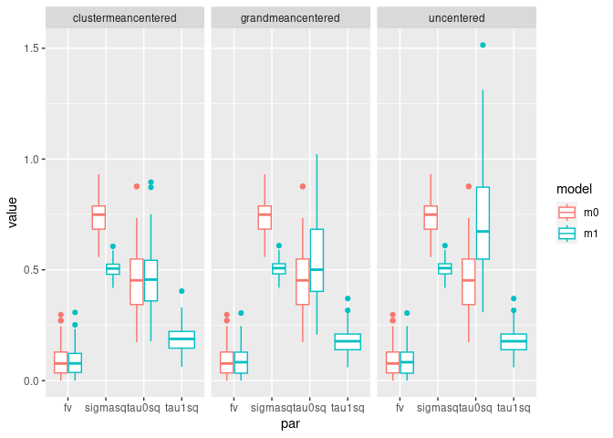

# Collinearity in Mixed-Effect Models


HSB Example

``` r
library(lme4)
```

    Loading required package: Matrix

``` r
data(Hsb82, package = "mlmRev")
m1 <- lmer(mAch ~ sector * ses + meanses + (ses | school), data = Hsb82)
# Fixed-effect design matrix
X <- model.matrix(m1)
# Centering matrix
num_obs <- nrow(X)
C <- diag(num_obs) - matrix(1 / num_obs, nrow = num_obs, ncol = num_obs)
Xc <- C %*% X
# Random-effect design matrix
Z <- model.matrix(m1, type = "random")
Z0 <- Z[, 1:(ncol(Z) / 2) * 2 - 1]
Z1 <- Z[, 1:(ncol(Z) / 2) * 2]
```

## Collinearity Among columns of $\mathbf X$

``` r
round(crossprod(Xc) / num_obs, digits = 3)
```

                       (Intercept) sectorCatholic   ses meanses sectorCatholic:ses
    (Intercept)                  0          0.000 0.000   0.000              0.000
    sectorCatholic               0          0.250 0.074   0.074              0.037
    ses                          0          0.074 0.607   0.171              0.282
    meanses                      0          0.074 0.171   0.171              0.091
    sectorCatholic:ses           0          0.037 0.282   0.091              0.276

## Collinearity Among $\mathbf Z$

``` r
ns <- colSums(Z0) # cluster sizes
round(diag(crossprod(Z0, Z1)) / ns, digits = 3)
```

      8367   8854   4458   5762   6990   5815   7172   4868   7341   1358   4383 
     0.026 -0.757 -1.049 -1.194 -0.490 -0.680 -0.290  0.361 -0.164 -0.020  0.073 
      2305   8800   3088   8775   7890   6144   6443   5192   6808   2818   9340 
    -0.628 -0.709 -0.473 -0.340 -0.523 -0.438 -0.353 -0.064 -0.096  0.109 -0.397 
      4523   6816   2277   8009   5783   3013   7101   4530   9021   4511   2639 
    -0.054  0.529 -0.762  0.516  0.173 -0.044  0.007 -0.597  0.627 -0.107 -0.964 
      3377   6578   9347   3705   3533   1296   4350   9397   4253   2655   7342 
    -0.585 -0.517  0.212  0.235 -0.134 -0.426  0.153  0.134 -0.374 -0.702 -0.448 
      9292   3499   7364   8983   5650   2658   8188   4410   9508   8707   1499 
    -0.594  0.450 -0.089 -0.294  0.022  0.438  0.139  0.096 -0.138  0.155 -0.466 
      8477   1288   6291   1224   4292   8857   3967   6415   1317   2629   4223 
    -0.196  0.122 -0.522 -0.434 -0.486  0.517 -0.225 -0.187  0.345 -0.138 -0.094 
      1462   9550   6464   4931   5937   7919   3716   1909   2651   2467   1374 
    -0.669  0.053 -0.676  0.365  0.651  0.458 -0.421  0.248  0.063 -0.330 -0.013 
      6600   5667   5720   3498   3881   2995   5838   3688   9158   8946   7232 
    -0.054  0.419  0.033  0.660  0.128 -0.302  0.157  0.405 -0.402 -0.351 -0.090 
      2917   6170   8165   9104   2030   8150   4042   8357   8531   6074   4420 
    -0.798 -0.302  0.309  0.743  0.328  0.306  0.402 -0.107  0.408 -0.277 -0.224 
      1906   3992   3999   4173   4325   5761   6484   6897   7635   7734   8175 
     0.512  0.365 -0.091  0.032 -0.049 -0.323 -0.185  0.350  0.243 -0.469 -0.172 
      8874   9225   2458   3610   5640   3838   9359   2208   6089   1477   2768 
    -0.341  0.253  0.228  0.120 -0.177  0.145  0.354  0.423  0.086  0.160 -0.054 
      3039   5819   6397   1308   1433   1436   1461   1637   1942   1946   2336 
     0.348  0.182 -0.216  0.528  0.712  0.563  0.677 -0.705  0.682  0.004  0.442 
      2526   2626   2755   2771   2990   3020   3152   3332   3351   3427   3657 
     0.327 -0.065  0.556 -0.339  0.655  0.230  0.031  0.611  0.326  0.153 -0.649 
      4642   5404   5619   6366   6469   7011   7276   7332   7345   7688   7697 
     0.115  0.825  0.420  0.310  0.753 -0.031  0.078  0.297  0.033  0.186  0.258 
      8193   8202   8627   8628   9198   9586 
    -0.177  0.086  0.105 -0.140  0.492  0.621 

Clearly $\mathbf Z_0$ and $\mathbf Z_1$ are correlated.

## Collinearity Between $\mathbf X$ and $\mathbf Z_0$

``` r
crossprod(Xc, Z0) |>
    sweep(MARGIN = 2, STATS = ns, FUN = "/") |>
    round(digits = 3)
```

    5 x 160 Matrix of class "dgeMatrix"
                         8367   8854   4458   5762   6990   5815   7172  4868
    (Intercept)         0.000  0.000  0.000  0.000  0.000  0.000  0.000 0.000
    sectorCatholic     -0.493 -0.493 -0.493 -0.493 -0.493 -0.493  0.507 0.507
    ses                 0.025 -0.757 -1.050 -1.194 -0.490 -0.680 -0.290 0.361
    meanses             0.025 -0.757 -1.050 -1.194 -0.490 -0.680 -0.290 0.361
    sectorCatholic:ses -0.074 -0.074 -0.074 -0.074 -0.074 -0.074 -0.364 0.287
                         7341   1358   4383   2305   8800   3088   8775   7890
    (Intercept)         0.000  0.000  0.000  0.000  0.000  0.000  0.000  0.000
    sectorCatholic     -0.493 -0.493 -0.493  0.507  0.507 -0.493 -0.493 -0.493
    ses                -0.164 -0.020  0.073 -0.628 -0.709 -0.473 -0.340 -0.523
    meanses            -0.164 -0.020  0.073 -0.628 -0.709 -0.473 -0.340 -0.523
    sectorCatholic:ses -0.074 -0.074 -0.074 -0.702 -0.783 -0.074 -0.074 -0.074
                         6144   6443   5192   6808   2818   9340   4523  6816
    (Intercept)         0.000  0.000  0.000  0.000  0.000  0.000  0.000 0.000
    sectorCatholic     -0.493 -0.493  0.507 -0.493 -0.493 -0.493  0.507 0.507
    ses                -0.438 -0.353 -0.064 -0.096  0.109 -0.397 -0.054 0.529
    meanses            -0.438 -0.353 -0.064 -0.096  0.109 -0.397 -0.054 0.529
    sectorCatholic:ses -0.074 -0.074 -0.138 -0.074 -0.074 -0.074 -0.128 0.455
                         2277  8009   5783   3013   7101   4530  9021   4511   2639
    (Intercept)         0.000 0.000  0.000  0.000  0.000  0.000 0.000  0.000  0.000
    sectorCatholic      0.507 0.507 -0.493 -0.493 -0.493  0.507 0.507  0.507 -0.493
    ses                -0.762 0.515  0.173 -0.044  0.007 -0.597 0.626 -0.107 -0.965
    meanses            -0.762 0.515  0.173 -0.044  0.007 -0.597 0.626 -0.107 -0.965
    sectorCatholic:ses -0.836 0.442 -0.074 -0.074 -0.074 -0.671 0.553 -0.181 -0.074
                         3377   6578  9347  3705   3533   1296   4350   9397   4253
    (Intercept)         0.000  0.000 0.000 0.000  0.000  0.000  0.000  0.000  0.000
    sectorCatholic     -0.493  0.507 0.507 0.507  0.507 -0.493 -0.493 -0.493  0.507
    ses                -0.585 -0.517 0.212 0.235 -0.135 -0.426  0.152  0.134 -0.374
    meanses            -0.585 -0.517 0.212 0.235 -0.135 -0.426  0.152  0.134 -0.374
    sectorCatholic:ses -0.074 -0.590 0.138 0.161 -0.208 -0.074 -0.074 -0.074 -0.448
                         2655   7342   9292  3499   7364   8983   5650  2658   8188
    (Intercept)         0.000  0.000  0.000 0.000  0.000  0.000  0.000 0.000  0.000
    sectorCatholic     -0.493  0.507 -0.493 0.507  0.507 -0.493  0.507 0.507 -0.493
    ses                -0.702 -0.448 -0.594 0.450 -0.090 -0.294  0.022 0.438  0.139
    meanses            -0.702 -0.448 -0.594 0.450 -0.090 -0.294  0.022 0.438  0.139
    sectorCatholic:ses -0.074 -0.522 -0.074 0.376 -0.163 -0.074 -0.051 0.365 -0.074
                         4410   9508   8707   1499   8477   1288   6291   1224
    (Intercept)         0.000  0.000  0.000  0.000  0.000  0.000  0.000  0.000
    sectorCatholic     -0.493  0.507 -0.493 -0.493 -0.493 -0.493 -0.493 -0.493
    ses                 0.096 -0.138  0.155 -0.466 -0.196  0.121 -0.522 -0.435
    meanses             0.096 -0.138  0.155 -0.466 -0.196  0.121 -0.522 -0.435
    sectorCatholic:ses -0.074 -0.212 -0.074 -0.074 -0.074 -0.074 -0.074 -0.074
                         4292  8857   3967   6415  1317   2629   4223   1462   9550
    (Intercept)         0.000 0.000  0.000  0.000 0.000  0.000  0.000  0.000  0.000
    sectorCatholic      0.507 0.507 -0.493 -0.493 0.507  0.507  0.507  0.507 -0.493
    ses                -0.486 0.517 -0.225 -0.187 0.345 -0.138 -0.094 -0.670  0.053
    meanses            -0.486 0.517 -0.225 -0.187 0.345 -0.138 -0.094 -0.670  0.053
    sectorCatholic:ses -0.560 0.443 -0.074 -0.074 0.271 -0.212 -0.168 -0.743 -0.074
                         6464  4931   5937   7919   3716   1909   2651   2467
    (Intercept)         0.000 0.000  0.000  0.000  0.000  0.000  0.000  0.000
    sectorCatholic     -0.493 0.507 -0.493 -0.493 -0.493 -0.493 -0.493 -0.493
    ses                -0.676 0.365  0.651  0.458 -0.421  0.248  0.063 -0.330
    meanses            -0.676 0.365  0.651  0.458 -0.421  0.248  0.063 -0.330
    sectorCatholic:ses -0.074 0.291 -0.074 -0.074 -0.074 -0.074 -0.074 -0.074
                         1374   6600  5667   5720  3498   3881   2995   5838  3688
    (Intercept)         0.000  0.000 0.000  0.000 0.000  0.000  0.000  0.000 0.000
    sectorCatholic     -0.493 -0.493 0.507  0.507 0.507 -0.493 -0.493 -0.493 0.507
    ses                -0.013 -0.054 0.419  0.032 0.659  0.127 -0.302  0.156 0.405
    meanses            -0.013 -0.054 0.419  0.032 0.659  0.127 -0.302  0.156 0.405
    sectorCatholic:ses -0.074 -0.074 0.345 -0.041 0.586 -0.074 -0.074 -0.074 0.331
                         9158   8946   7232   2917   6170  8165  9104   2030  8150
    (Intercept)         0.000  0.000  0.000  0.000  0.000 0.000 0.000  0.000 0.000
    sectorCatholic     -0.493 -0.493 -0.493 -0.493 -0.493 0.507 0.507 -0.493 0.507
    ses                -0.402 -0.352 -0.090 -0.798 -0.302 0.309 0.743  0.328 0.306
    meanses            -0.402 -0.352 -0.090 -0.798 -0.302 0.309 0.743  0.328 0.306
    sectorCatholic:ses -0.074 -0.074 -0.074 -0.074 -0.074 0.235 0.670 -0.074 0.232
                        4042   8357   8531   6074   4420  1906  3992   3999   4173
    (Intercept)        0.000  0.000  0.000  0.000  0.000 0.000 0.000  0.000  0.000
    sectorCatholic     0.507 -0.493 -0.493  0.507 -0.493 0.507 0.507 -0.493  0.507
    ses                0.402 -0.107  0.408 -0.277 -0.224 0.511 0.365 -0.091  0.032
    meanses            0.402 -0.107  0.408 -0.277 -0.224 0.511 0.365 -0.091  0.032
    sectorCatholic:ses 0.328 -0.074 -0.074 -0.351 -0.074 0.438 0.291 -0.074 -0.042
                         4325   5761   6484   6897  7635   7734   8175   8874
    (Intercept)         0.000  0.000  0.000  0.000 0.000  0.000  0.000  0.000
    sectorCatholic     -0.493  0.507 -0.493 -0.493 0.507 -0.493 -0.493 -0.493
    ses                -0.049 -0.323 -0.185  0.349 0.243 -0.470 -0.172 -0.341
    meanses            -0.049 -0.323 -0.185  0.349 0.243 -0.470 -0.172 -0.341
    sectorCatholic:ses -0.074 -0.397 -0.074 -0.074 0.169 -0.074 -0.074 -0.074
                         9225  2458  3610   5640  3838  9359  2208   6089  1477
    (Intercept)         0.000 0.000 0.000  0.000 0.000 0.000 0.000  0.000 0.000
    sectorCatholic     -0.493 0.507 0.507 -0.493 0.507 0.507 0.507 -0.493 0.507
    ses                 0.253 0.228 0.120 -0.177 0.145 0.354 0.423  0.086 0.159
    meanses             0.253 0.228 0.120 -0.177 0.145 0.354 0.423  0.086 0.159
    sectorCatholic:ses -0.074 0.154 0.046 -0.074 0.071 0.280 0.349 -0.074 0.086
                         2768  3039   5819   6397  1308  1433  1436   1461   1637
    (Intercept)         0.000 0.000  0.000  0.000 0.000 0.000 0.000  0.000  0.000
    sectorCatholic     -0.493 0.507 -0.493 -0.493 0.507 0.507 0.507 -0.493 -0.493
    ses                -0.054 0.348  0.181 -0.217 0.528 0.712 0.563  0.677 -0.706
    meanses            -0.054 0.348  0.181 -0.217 0.528 0.712 0.563  0.677 -0.706
    sectorCatholic:ses -0.074 0.274 -0.074 -0.074 0.454 0.638 0.489 -0.074 -0.074
                         1942   1946   2336  2526   2626  2755   2771  2990  3020
    (Intercept)         0.000  0.000  0.000 0.000  0.000 0.000  0.000 0.000 0.000
    sectorCatholic     -0.493 -0.493 -0.493 0.507 -0.493 0.507 -0.493 0.507 0.507
    ses                 0.682  0.004  0.441 0.327 -0.065 0.556 -0.340 0.655 0.230
    meanses             0.682  0.004  0.441 0.327 -0.065 0.556 -0.340 0.655 0.230
    sectorCatholic:ses -0.074 -0.074 -0.074 0.253 -0.074 0.482 -0.074 0.581 0.156
                         3152   3332   3351  3427   3657   4642  5404  5619  6366
    (Intercept)         0.000  0.000  0.000 0.000  0.000  0.000 0.000 0.000 0.000
    sectorCatholic     -0.493 -0.493 -0.493 0.507 -0.493 -0.493 0.507 0.507 0.507
    ses                 0.031  0.611  0.326 0.153 -0.649  0.115 0.825 0.420 0.310
    meanses             0.031  0.611  0.326 0.153 -0.649  0.115 0.825 0.420 0.310
    sectorCatholic:ses -0.074 -0.074 -0.074 0.079 -0.074 -0.074 0.751 0.346 0.236
                        6469   7011   7276  7332   7345  7688   7697   8193   8202
    (Intercept)        0.000  0.000  0.000 0.000  0.000 0.000  0.000  0.000  0.000
    sectorCatholic     0.507  0.507 -0.493 0.507 -0.493 0.507 -0.493  0.507 -0.493
    ses                0.752 -0.031  0.078 0.297  0.033 0.186  0.258 -0.177  0.086
    meanses            0.752 -0.031  0.078 0.297  0.033 0.186  0.258 -0.177  0.086
    sectorCatholic:ses 0.679 -0.105 -0.074 0.223 -0.074 0.112 -0.074 -0.251 -0.074
                         8627   8628  9198  9586
    (Intercept)         0.000  0.000 0.000 0.000
    sectorCatholic     -0.493  0.507 0.507 0.507
    ses                 0.105 -0.140 0.492 0.621
    meanses             0.105 -0.140 0.492 0.621
    sectorCatholic:ses -0.074 -0.214 0.418 0.547

## Collinearity Between $\mathbf X$ and $\mathbf Z_1$

``` r
crossprod(Xc, Z1) |>
    sweep(MARGIN = 2, STATS = ns, FUN = "/") |>
    round(digits = 3)
```

    5 x 160 Matrix of class "dgeMatrix"
                         8367  8854  4458  5762  6990  5815   7172  4868  7341
    (Intercept)         0.000 0.000 0.000 0.000 0.000 0.000  0.000 0.000 0.000
    sectorCatholic     -0.013 0.373 0.517 0.589 0.241 0.335 -0.147 0.183 0.081
    ses                 0.531 1.198 1.510 1.684 0.959 0.776  0.531 0.620 0.739
    meanses             0.001 0.573 1.102 1.426 0.240 0.462  0.084 0.130 0.027
    sectorCatholic:ses -0.002 0.056 0.078 0.088 0.036 0.050  0.553 0.593 0.012
                        1358   4383   2305   8800  3088  8775  7890  6144  6443
    (Intercept)        0.000  0.000  0.000  0.000 0.000 0.000 0.000 0.000 0.000
    sectorCatholic     0.010 -0.036 -0.318 -0.360 0.233 0.167 0.258 0.216 0.174
    ses                0.418  0.333  0.818  1.067 0.844 0.554 0.618 0.696 0.699
    meanses            0.000  0.005  0.394  0.503 0.223 0.115 0.273 0.191 0.125
    sectorCatholic:ses 0.001 -0.005  0.864  1.119 0.035 0.025 0.039 0.032 0.026
                         5192  6808   2818  9340   4523  6816   2277  8009   5783
    (Intercept)         0.000 0.000  0.000 0.000  0.000 0.000  0.000 0.000  0.000
    sectorCatholic     -0.032 0.047 -0.054 0.196 -0.027 0.268 -0.386 0.261 -0.085
    ses                 0.618 0.637  0.388 0.474  0.507 0.769  1.015 0.576  0.597
    meanses             0.004 0.009  0.012 0.158  0.003 0.280  0.581 0.266  0.030
    sectorCatholic:ses  0.623 0.007 -0.008 0.029  0.511 0.730  1.071 0.538 -0.013
                        3013   7101   4530  9021   4511  2639  3377   6578  9347
    (Intercept)        0.000  0.000  0.000 0.000  0.000 0.000 0.000  0.000 0.000
    sectorCatholic     0.022 -0.003 -0.303 0.318 -0.054 0.476 0.289 -0.262 0.107
    ses                0.228  0.643  0.736 0.730  0.344 1.304 0.811  0.651 0.507
    meanses            0.002  0.000  0.356 0.393  0.011 0.930 0.343  0.267 0.045
    sectorCatholic:ses 0.003 -0.001  0.780 0.683  0.352 0.071 0.043  0.689 0.491
                        3705   3533  1296   4350   9397   4253  2655   7342  9292
    (Intercept)        0.000  0.000 0.000  0.000  0.000  0.000 0.000  0.000 0.000
    sectorCatholic     0.119 -0.068 0.210 -0.075 -0.066 -0.189 0.346 -0.227 0.293
    ses                0.516  0.301 0.591  0.461  0.377  0.616 0.878  0.514 0.609
    meanses            0.055  0.018 0.181  0.023  0.018  0.140 0.492  0.201 0.353
    sectorCatholic:ses 0.499  0.311 0.031 -0.011 -0.010  0.643 0.052  0.547 0.044
                        3499   7364  8983  5650  2658   8188   4410   9508   8707
    (Intercept)        0.000  0.000 0.000 0.000 0.000  0.000  0.000  0.000  0.000
    sectorCatholic     0.228 -0.045 0.145 0.011 0.222 -0.069 -0.048 -0.070 -0.076
    ses                0.589  0.258 0.486 0.592 0.593  0.466  0.379  0.335  0.657
    meanses            0.202  0.008 0.086 0.001 0.192  0.019  0.009  0.019  0.024
    sectorCatholic:ses 0.555  0.264 0.022 0.590 0.561 -0.010 -0.007  0.345 -0.011
                        1499  8477   1288  6291  1224   4292  8857  3967  6415
    (Intercept)        0.000 0.000  0.000 0.000 0.000  0.000 0.000 0.000 0.000
    sectorCatholic     0.230 0.097 -0.060 0.257 0.214 -0.246 0.262 0.111 0.092
    ses                0.728 0.668  0.445 0.638 0.574  0.654 0.546 0.438 0.496
    meanses            0.217 0.038  0.015 0.272 0.189  0.236 0.267 0.051 0.035
    sectorCatholic:ses 0.034 0.014 -0.009 0.039 0.032  0.690 0.508 0.017 0.014
                        1317   2629   4223   1462   9550  6464  4931   5937   7919
    (Intercept)        0.000  0.000  0.000  0.000  0.000 0.000 0.000  0.000  0.000
    sectorCatholic     0.175 -0.070 -0.048 -0.339 -0.026 0.333 0.185 -0.321 -0.226
    ses                0.422  0.509  0.368  0.778  0.597 0.838 0.591  0.739  0.490
    meanses            0.119  0.019  0.009  0.448  0.003 0.457 0.133  0.424  0.209
    sectorCatholic:ses 0.397  0.519  0.375  0.827 -0.004 0.050 0.564 -0.048 -0.034
                        3716   1909   2651  2467  1374  6600  5667  5720  3498
    (Intercept)        0.000  0.000  0.000 0.000 0.000 0.000 0.000 0.000 0.000
    sectorCatholic     0.207 -0.122 -0.031 0.163 0.006 0.026 0.212 0.017 0.334
    ses                0.819  0.551  0.403 0.366 0.471 0.486 0.567 0.434 0.761
    meanses            0.177  0.062  0.004 0.109 0.000 0.003 0.176 0.001 0.435
    sectorCatholic:ses 0.031 -0.018 -0.005 0.024 0.001 0.004 0.536 0.431 0.713
                         3881  2995   5838  3688  9158  8946  7232  2917  6170
    (Intercept)         0.000 0.000  0.000 0.000 0.000 0.000 0.000 0.000 0.000
    sectorCatholic     -0.063 0.149 -0.077 0.205 0.198 0.173 0.044 0.394 0.149
    ses                 0.295 0.861  0.398 0.453 0.709 0.679 0.332 1.443 0.734
    meanses             0.016 0.091  0.024 0.164 0.162 0.124 0.008 0.637 0.091
    sectorCatholic:ses -0.009 0.022 -0.012 0.423 0.030 0.026 0.007 0.059 0.022
                        8165  9104   2030  8150  4042  8357   8531   6074  4420
    (Intercept)        0.000 0.000  0.000 0.000 0.000 0.000  0.000  0.000 0.000
    sectorCatholic     0.157 0.377 -0.162 0.155 0.204 0.053 -0.201 -0.140 0.111
    ses                0.486 0.751  0.560 0.459 0.557 1.027  0.622  0.463 0.505
    meanses            0.095 0.553  0.108 0.094 0.162 0.012  0.166  0.077 0.050
    sectorCatholic:ses 0.463 0.696 -0.024 0.437 0.527 0.008 -0.030  0.483 0.017
                        1906  3992  3999  4173  4325   5761  6484   6897  7635
    (Intercept)        0.000 0.000 0.000 0.000 0.000  0.000 0.000  0.000 0.000
    sectorCatholic     0.259 0.185 0.045 0.016 0.024 -0.164 0.091 -0.172 0.123
    ses                0.631 0.493 0.825 0.393 0.652  0.602 0.505  0.665 0.506
    meanses            0.262 0.133 0.008 0.001 0.002  0.104 0.034  0.122 0.059
    sectorCatholic:ses 0.593 0.466 0.007 0.390 0.004  0.626 0.014 -0.026 0.488
                        7734  8175  8874   9225  2458  3610  5640  3838  9359  2208
    (Intercept)        0.000 0.000 0.000  0.000 0.000 0.000 0.000 0.000 0.000 0.000
    sectorCatholic     0.231 0.085 0.168 -0.125 0.115 0.061 0.087 0.074 0.179 0.214
    ses                0.978 0.497 0.611  0.587 0.478 0.407 0.365 0.468 0.447 0.531
    meanses            0.220 0.029 0.116  0.064 0.052 0.014 0.031 0.021 0.125 0.179
    sectorCatholic:ses 0.035 0.013 0.025 -0.019 0.461 0.398 0.013 0.457 0.421 0.500
                         6089  1477  2768  3039   5819  6397  1308  1433  1436
    (Intercept)         0.000 0.000 0.000 0.000  0.000 0.000 0.000 0.000 0.000
    sectorCatholic     -0.042 0.081 0.026 0.176 -0.090 0.107 0.268 0.361 0.285
    ses                 0.489 0.474 0.780 0.595  0.387 0.614 0.497 0.850 0.636
    meanses             0.007 0.025 0.003 0.121  0.033 0.047 0.279 0.507 0.317
    sectorCatholic:ses -0.006 0.463 0.004 0.569 -0.013 0.016 0.458 0.798 0.595
                         1461  1637   1942   1946   2336  2526  2626  2755  2771
    (Intercept)         0.000 0.000  0.000  0.000  0.000 0.000 0.000 0.000 0.000
    sectorCatholic     -0.334 0.348 -0.336 -0.002 -0.218 0.166 0.032 0.282 0.167
    ses                 0.924 1.055  0.732  0.475  0.596 0.473 0.310 0.697 0.374
    meanses             0.459 0.498  0.465  0.000  0.195 0.107 0.004 0.309 0.115
    sectorCatholic:ses -0.050 0.052 -0.050  0.000 -0.033 0.449 0.005 0.656 0.025
                        2990  3020   3152   3332   3351  3427  3657   4642  5404
    (Intercept)        0.000 0.000  0.000  0.000  0.000 0.000 0.000  0.000 0.000
    sectorCatholic     0.332 0.117 -0.015 -0.302 -0.161 0.078 0.320 -0.057 0.418
    ses                0.865 0.472  0.705  0.701  0.794 0.455 1.016  0.450 0.930
    meanses            0.429 0.053  0.001  0.374  0.106 0.023 0.422  0.013 0.680
    sectorCatholic:ses 0.817 0.455 -0.002 -0.045 -0.024 0.444 0.048 -0.009 0.869
                        5619  6366  6469   7011   7276  7332   7345  7688   7697
    (Intercept)        0.000 0.000 0.000  0.000  0.000 0.000  0.000 0.000  0.000
    sectorCatholic     0.213 0.157 0.381 -0.016 -0.039 0.151 -0.016 0.094 -0.127
    ses                0.528 0.525 0.952  0.375  0.619 0.525  0.671 0.347  0.431
    meanses            0.177 0.096 0.566  0.001  0.006 0.088  0.001 0.035  0.067
    sectorCatholic:ses 0.497 0.502 0.896  0.377 -0.006 0.503 -0.002 0.333 -0.019
                         8193   8202   8627   8628  9198  9586
    (Intercept)         0.000  0.000  0.000  0.000 0.000 0.000
    sectorCatholic     -0.090 -0.042 -0.052 -0.071 0.249 0.315
    ses                 0.355  0.489  0.502  0.350 0.652 0.734
    meanses             0.031  0.007  0.011  0.020 0.242 0.386
    sectorCatholic:ses  0.368 -0.006 -0.008  0.361 0.616 0.688

# Simulated Data on Collinearity Between $\mathbf Z_0$ and $\mathbf Z_1$

This simulation shows an example how variances of random slopes are
redistributed based on the choice of centering.

``` r
set.seed(2132)
nsim <- 100
out <- rep(list(matrix(NA, nrow = 7, ncol = nsim,
    dimnames = list(c("fv_m1", "tau0sq_m1", "tau1sq_m1", "sigmasq_m1", 
                      "fv_m0", "tau0sq_m0", "sigmasq_m0"), NULL))), 3) |>
    setNames(c("uncentered", "grandmeancentered", "clustermeancentered"))

# Design parameters
num_clus <- 25
num_obs <- 20
vb_x <- 1.5
gamma <- c(1, .2)
D_mat <- matrix(c(1, 0, 0, 0.4), nrow = 2)
clus_id <- rep(1:num_clus, each = num_obs)
sigma2 <- 0.5

# Design matrix
xw <- rnorm(num_clus * num_obs) # within component of X
xw <- xw - ave(xw, clus_id)
xw <- xw / mean(xw^2)
xb <- rnorm(num_clus, sd = sqrt(vb_x)) # between component of X
xb <- (xb - mean(xb) + 1)[clus_id]
x <- xb + xw
X <- cbind(1, x)
Z <- Matrix::bdiag(
    rep(list(matrix(1, nrow = num_obs, ncol = 2)), num_clus)
) *
    cbind(1, xw)[, rep(1:2, num_clus)]
fixed <- X %*% gamma

# Constant values
sigmax <- matrix(c(0, 0, 0, mean((x - mean(x))^2)), nrow = 2)
Kz <- sigmax + tcrossprod(c(1, mean(x))) # also Kz

# Simulate data
for (i in seq_len(nsim)) {
    u <- MASS::mvrnorm(num_clus,
        mu = rep(0, 2),
        Sigma = D_mat * sigma2
    )
    y <- fixed + Z %*% c(t(u)) +
        rnorm(num_clus * num_obs, sd = sqrt(sigma2))
    dat <- data.frame(y = as.numeric(y), x = x, clus_id = clus_id,
                      xw = xw, xc = x - mean(x))
                      
    m0unc <- lmer(y ~ x + (1 | clus_id), data = dat,
                  control = lmerControl(calc.derivs = FALSE))
    m1unc <- lmer(y ~ x + (x | clus_id), data = dat,
                  control = lmerControl(calc.derivs = FALSE))
    m0gmc <- lmer(y ~ xc + (1 | clus_id), data = dat,
                  control = lmerControl(calc.derivs = FALSE))
    m1gmc <- lmer(y ~ xc + (xc | clus_id), data = dat,
                  control = lmerControl(calc.derivs = FALSE))
    m0cmc <- lmer(y ~ x + (1 | clus_id), data = dat,
                  control = lmerControl(calc.derivs = FALSE))
    m1cmc <- lmer(y ~ x + (xw | clus_id), data = dat,
                  control = lmerControl(calc.derivs = FALSE))
    out[[1]][, i] <- c(
        fixef(m1unc)[["x"]]^2 * sigmax[2, 2],
        VarCorr(m1unc)[["clus_id"]][c(1, 4)],
        sigma(m1unc)^2,
        fixef(m0unc)[["x"]]^2 * sigmax[2, 2],
        m0unc@theta^2 * sigma(m0unc)^2,
        sigma(m0unc)^2
    )
    out[[2]][, i] <- c(
        fixef(m1gmc)[["xc"]]^2 * sigmax[2, 2],
        VarCorr(m1gmc)[["clus_id"]][c(1, 4)],
        sigma(m1gmc)^2,
        fixef(m0gmc)[["xc"]]^2 * sigmax[2, 2],
        m0gmc@theta^2 * sigma(m0gmc)^2,
        sigma(m0gmc)^2
    )
    out[[3]][, i] <- c(
        fixef(m1cmc)[["x"]]^2 * sigmax[2, 2],
        VarCorr(m1cmc)[["clus_id"]][c(1, 4)],
        sigma(m1cmc)^2,
        fixef(m0cmc)[["x"]]^2 * sigmax[2, 2],
        m0cmc@theta^2 * sigma(m0cmc)^2,
        sigma(m0cmc)^2
    )
}
```

``` r
library(tidyr)
```


    Attaching package: 'tidyr'

    The following objects are masked from 'package:Matrix':

        expand, pack, unpack

``` r
library(ggplot2)
# Change in fixed effect variance, random intercept variance, and sigma^2
lapply(1:3, FUN = \(i) data.frame(t(out[[i]]), centering = names(out)[i])) |>
    do.call(what = rbind) |>
    pivot_longer(cols = fv_m1:sigmasq_m0,
                 names_to = c("par", "model"),
                 names_sep = "_") |>
    ggplot(aes(x = par, y = value, color = model)) +
    geom_boxplot() +
    facet_wrap(~ centering)
```


